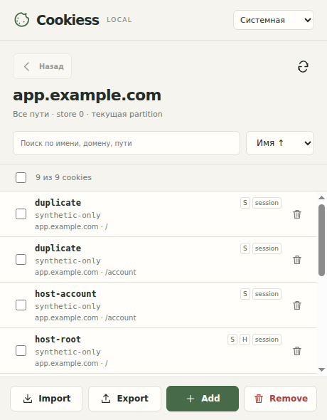

# Cookiess

Локальный менеджер cookies текущего сайта для Chrome 132+. Manifest V3, TypeScript, Vite и лёгкий DOM UI. Русский интерфейс, светлая/тёмная/системная тема. Без сервера, аналитики, удалённых ресурсов и AI-функций.



Скриншот настоящего popup расширения; все показанные cookies — искусственные тестовые данные.

## Установка готовой сборки

1. Скачайте ZIP из [последнего релиза](https://github.com/smallp80380/cookiess/releases/latest) и распакуйте в отдельную папку. При сборке из исходников используйте `dist/` или `artifacts/cookiess-1.0.2.zip`.
2. В Chrome откройте `chrome://extensions` и включите «Режим разработчика».
3. Нажмите «Загрузить распакованное расширение» и выберите папку с `manifest.json`.
4. Закрепите Cookiess в панели расширений. Откройте HTTP/HTTPS-сайт и нажмите иконку.
5. При первом обращении нажмите «Разрешить доступ» и подтвердите запрос Chrome.

На Windows можно выбрать WSL-папку через `\\wsl.localhost\Ubuntu\home\ubuntu\projects\cookiess\dist` (название дистрибутива может отличаться) или скопировать распакованную сборку в обычную папку. Проект не изменяет Windows и не обращается к вашему профилю при тестировании.

## Использование

Список содержит host-only cookies текущего хоста и подходящие parent-domain cookies на всех путях. Не включает host-only родительского хоста, sibling domains, другой store, сторонние iframe или partition другого top-level сайта. Разрешение выдаётся на registrable domain и его поддомены, чтобы читать parent-domain cookies. Public/private suffixes определяет локально встроенный `tldts`; для localhost/IP доступ запрашивается на сам хост. Доступ к sibling cookies технически разрешён Chrome, но Cookiess отсекает их из операций и списка.

- Строка открывает редактор. Save перечитывает реальный результат. Cancel и переключение разделов защищают несохранённый черновик внутри popup. Закрытие самого popup браузером уничтожает черновик: Chrome не позволяет удержать это окно.
- Add создаёт host-only session cookie. Secure зависит от HTTP/HTTPS. Expiration задаётся Unix seconds, без преобразования часовых поясов. SameSite Unspecified сохраняется.
- Remove открывает меню выбранных записей и отдельное действие удаления всех. Без выбора массовое удаление не начинается. Все удаления требуют подтверждения. Поиск не расширяет выбор.
- При неоднозначном URL/name удаление блокируется. Если одинаковое имя есть на `/` и `/account`, сначала удалите `/`, затем `/account`. При одинаковом domain/path у parent-domain и host-only записей может не быть безопасного URL для удаления: операция отклоняется. Это намеренная защита, не скрытая потеря данных.
- Смена identity создаёт новую запись и затем удаляет старую, с отдельным предупреждением. Возможен частичный результат: новая запись уже создана, прежняя не удалена. Host-only и domain cookies одного домена — отдельные identity; если их URL/name совпадают, удаление старой записи может быть неоднозначным.
- Import: локальный файл или вставленный текст → политика конфликта → Предпросмотр → Применить. Не очищает сайт. Store источника заменяется store текущей вкладки. Чужие домены/partitions пропускаются. Итог отражает успешные операции, пропуски и ошибки, включая частичный результат.
- Export: весь сайт или явный выбор, независимо от поиска. Скачивание либо копирование; если clipboard недоступен, выделяется поле для Ctrl+C.
- Изменения через `cookies.onChanged` обновляют список. После перехода вкладки на другой origin сначала нажмите обновление. Перед каждой записью контекст и разрешения проверяются повторно.

## Форматы

Основной JSON: `{ "format": "cookiess", "version": 1, "cookies": [...] }`. Сохраняет все Chrome Cookie attributes и полный поддерживаемый partition key (`topLevelSite`, `hasCrossSiteAncestor`). Дополнительный JSON — массив объектов Cookie-Editor с Chrome-style атрибутами. Для массива Cookie-Editor `storeId: null` игнорируется, `sameSite: null` означает unspecified (адаптер сверен с upstream `jsonFormat.js`); при экспорте сохраняется этот контракт и показывается потеря исходного storeId. Неизвестные поля обозначаются в preview; неподдерживаемые версии и неверные типы отклоняются.

Netscape cookies.txt: семь tab-separated полей, CRLF/LF, комментарии и `#HttpOnly_`. `TRUE/FALSE` определяет domain/host-only; expiry `0` означает session. Формат теряет SameSite и store; импортирует SameSite как unspecified. Partitioned cookies нельзя экспортировать в TXT: используйте JSON либо явно выберите только unpartitioned строки. Значения с tabs/newlines не экспортируются в TXT. Импорт ограничен 10 MB. Восстановление файлов не гарантирует восстановления действующих сессий сайта.

## Разработка

Node.js 22.12+ и npm. Зависимости зафиксированы `package-lock.json`.

```sh
npm ci
npm run dev        # Vite build --watch; затем Reload в chrome://extensions
npm run build      # dist/
npm run typecheck
npm test           # Vitest: synthetic fixtures and injected API failure cases
npm run lint       # ESLint + typescript-eslint
npm run package    # build + ZIP (требуется python3)
```

`npm run dev` перестраивает распакованное расширение; это не обычный Vite web server. Service worker не нужен: все функции живут в trusted popup и используют настоящие Chrome API. Расширение не содержит mocks.

Browser acceptance: Linux, Xvfb, xdotool, ImageMagick и Chromium 154+ с CDP Extensions tools. Настройте `CHROMIUM_PATH` на ваш исполняемый Chromium, затем `xvfb-run -a npm run test:browser`. Скрипт загружает неизменённый `dist` через Chromium `--load-extension`, открывает native action popup через CDP, использует отдельный временный профиль и только искусственные данные. Для проверки incognito включает Developer mode и incognito access только в тестовом профиле, затем создаёт штатное incognito окно. Native consent coordinates рассчитаны на тестовое окно 1000×800, Xvfb scale 1; при другом окружении их надо адаптировать. HTTP/HTTPS-тестовые документы перехватываются Playwright, cookies проходят через настоящие Chrome API. Подробности и ограничения — `VERIFICATION.md`.

## Структура

- `src/domain.ts`: domain/public suffix rules, identity, partition/store scope, validation.
- `src/api.ts`: Chrome adapter, context/permission guards, safe CRUD, import preview/execution.
- `src/formats.ts`: pure parsers/serializers for the three formats.
- `src/main.ts`, `src/style.css`: Russian popup, accessibility, themes, UI state.
- `public/manifest.json`, `public/icons/`: packaged MV3 assets.
- `tests/`: synthetic domain, format and API tests.
- `scripts/`: browser acceptance and ZIP packaging.
- `screenshots/`: real test-popup images and machine-readable checks; synthetic data only.
- `dist/`: ready unpacked extension; `artifacts/`: install ZIP.
- `DESIGN.md`, `CHROMEWEBSTORE.md`, `VERIFICATION.md`: project decisions and delivery evidence.

## Разрешения и данные

`cookies` — доступ к cookie API. `activeTab` — URL сайта при нажатии иконки без чтения истории всех вкладок. `storage` — только выбранная тема. Optional host permissions `*://*/*` объявляют возможность запрашивать HTTP/HTTPS-сайты; runtime запрос ограничен выбранным сайтом. Полный доступ ко всем сайтам автоматически не запрашивается. `tabs`, `history`, `webRequest`, `debugger`, `downloads` и clipboard permissions отсутствуют. Скачивание через Blob/anchor; clipboard — только по явному действию.

Cookie values остаются в памяти popup и явно экспортируемых локальных файлах/clipboard. Не сохраняются в storage, не логируются и не отправляются в сеть. Скриншоты содержат исключительно синтетические данные. Incognito работает только если пользователь отдельно разрешил расширение в настройках Chrome; stores не смешиваются. См. ограничения реальной проверки в `VERIFICATION.md`.

## CI и подготовка к магазину

[GitHub Actions CI](https://github.com/smallp80380/cookiess/actions/workflows/ci.yml) проверяет typecheck, lint, unit-тесты, сборку и содержимое ZIP на Linux, Windows и macOS. Установочный ZIP сохраняется как артефакт Linux job. После этих проверок отдельные browser jobs загружают тот же установочный ZIP в новый синтетический профиль: Linux выполняет полный набор из 21 проверки настоящего popup; Windows проверяет загрузку ресурсов и два открытия native popup. Эти проверки обязательны перед обновлением Releases.

[Политика конфиденциальности](https://smallp80380.github.io/cookiess/) · [Исходный текст](PRIVACY.md) · [Материалы карточки](store/LISTING.md) · [Инструкция и ручные проверки](store/REVIEW.md).

Изображения карточки: `store/assets/`. Команда `npm run store:assets` воспроизводит их из настоящих синтетических popup-скриншотов; требуется Playwright Chromium либо `CHROMIUM_PATH`. Подготовка комплекта не означает публикацию в Chrome Web Store.

## Лицензия

Собственный код — [MIT](LICENSE). Лицензии встроенных зависимостей сохранены в [THIRD_PARTY_NOTICES.txt](public/THIRD_PARTY_NOTICES.txt).

## Автоматические сборки Releases

После push в `main` и успешных проверок сборки на трёх ОС и браузерных jobs на Linux/Windows workflow обновляет [релиз latest-build](https://github.com/smallp80380/cookiess/releases/tag/latest-build). [Скачать свежий ZIP](https://github.com/smallp80380/cookiess/releases/download/latest-build/cookiess-latest.zip).

Публикуется тот же ZIP, который был проверен Ubuntu job, с SHA-256 и `build-info.json` (версия, коммит, ссылка на CI). При ошибке проверки сборки или настоящего popup релиз не обновляется. PR не получает права публикации. Ручной запуск workflow для `main` также может обновить этот релиз.

`latest-build` — обновляемый предварительный релиз; тег указывает на опубликованный коммит. Версионные релизы `v1.0.0`, `v1.0.1` сохраняются отдельно. Публикации последовательно выполняются в одной группе workflow; устаревшая сборка пропускается, если в `main` уже появился новый коммит. После скачивания новой сборки распакуйте её в прежнюю папку и нажмите «Обновить» в `chrome://extensions` — автоматически установленное вручную расширение не обновляется.

Если popup показывает `ERR_FILE_NOT_FOUND`, проверьте в `chrome://extensions` (или `brave://extensions`), что открываете актуальную установку. Загрузка новой версии из другой папки создаёт отдельное распакованное расширение с другим ID; старая иконка может остаться закреплённой и ссылаться на удалённую папку. Удалите старую установку, закрепите актуальную. Для обновлений лучше сохранять одну постоянную папку.
